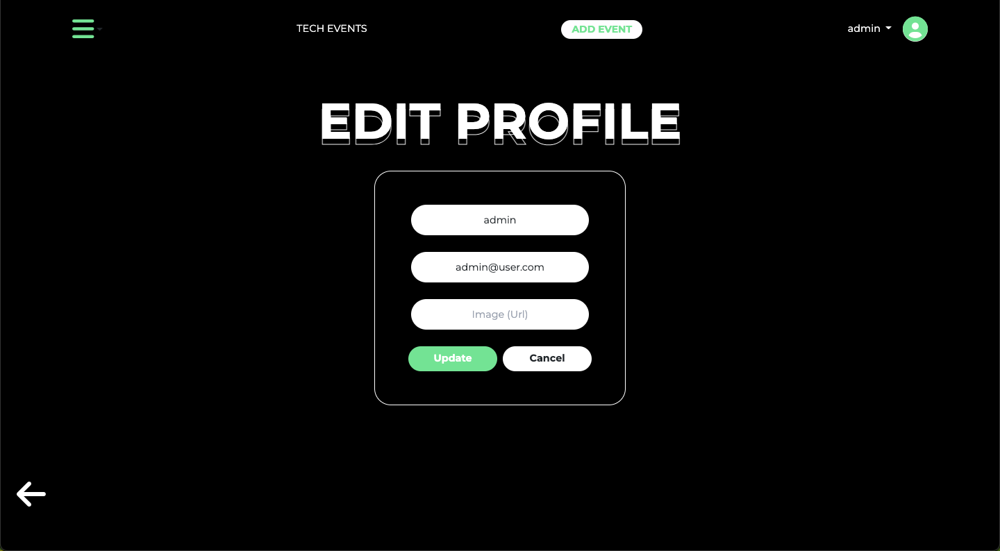
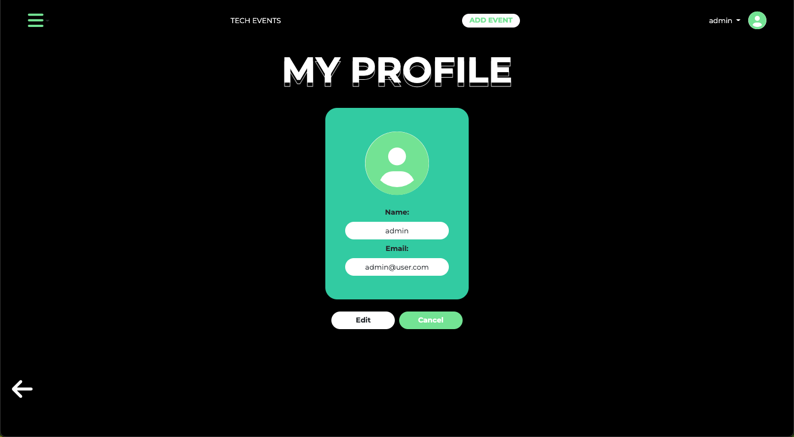
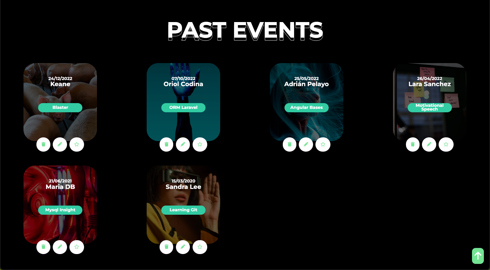
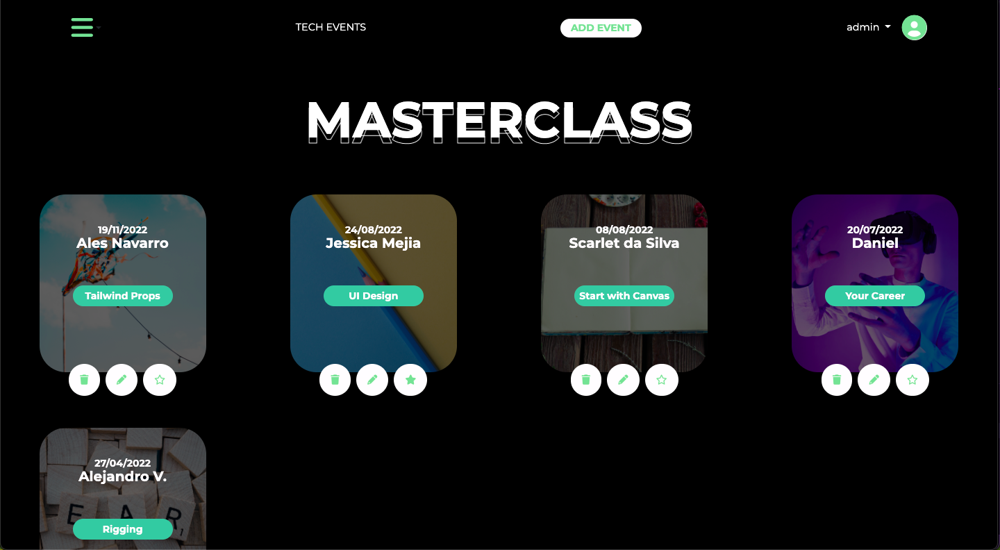
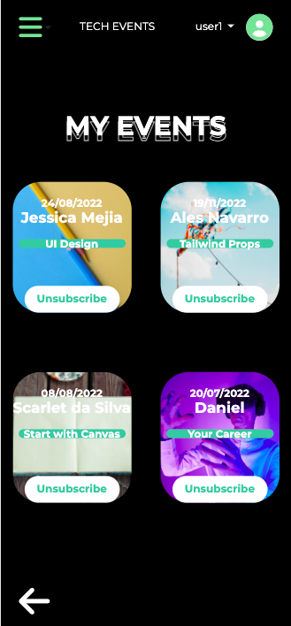
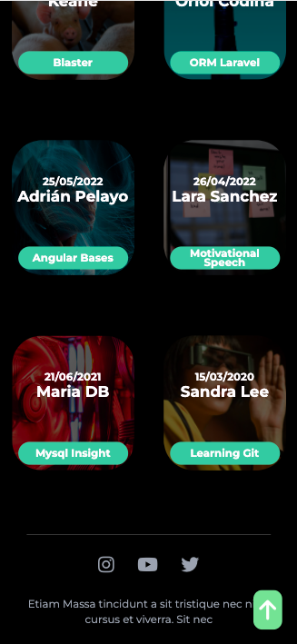
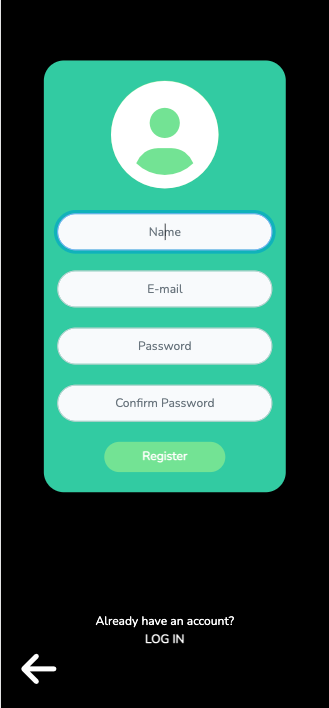
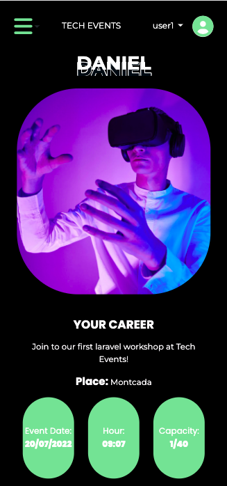
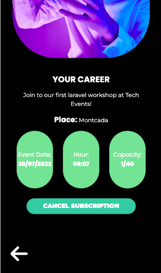

### Tech Events

## About the project
Tech Events is part of one of the Factoria F5 Bootcamp projects. The main goals of it are :

- To acquire the ability to create a fully functional database, using the MVC (Model View Controller) design pattern, using PHP, and Laravel. 

- Give the admin the ability to do CRUD (Create, Read, Update and Delete).

- Implement the rights depending if you are a  Guest, Admin or User.

- Understand the Laravel's logic.

- Use a framework (in our case, we choose Tailwind)

## What is Tech Events about?
Tech events is a web page where you can see different technological events, whether they are masterclasses, workshops or webinars.

You will be able to see the past events, the highlighted ones and the ones that are still available. If you are interested in one of the events, you can (by clicking on it) see more details about it, and if you wish, you can sign up for the event.

If you have missclicked, and you joined an event you didn't want to, don't worry! you will be able to unsubscribe without any problem. 

In addition, you will be able to see how many people have signed up for the event and the number of maximum places it has.

Furthermore, as a registered user, you will be able to access your profile and modify your data such as email, name and profile picture. And you will also have a page where you can see the events you have signed up for!

As an admin, you will be able to create, view, modify, delete and highlight events. Those that are marked as highlighted, will go directly to the landing page, and those events that have already ended, will be removed from the available events and will go directly to the "past events" page.

## Recommended before starting cloning

It is recommended to install the last version of  [composer](https://getcomposer.org/) and [xampp](https://www.apachefriends.org/es/index.html)

## First step
If you want to see our project you should first clone this repository, to do this, open the terminal in the file you want the project to be saved, and run the following command:
`$ git clone https://github.com/ginkgob/techEvents.git`

## Nexts steps to follow

Once you clone our respository, these are the next steps:

1. Copy the "exemple.env" code and in a new file copy the code from it and name this new file as ".env"

2. In this .env file, don't forget to name your DB_DATABASE with the same name as your new table in your local database.

3. Run the following commands:

`$ npm install`

`$ npm run watch`

4, Start your servers in xampp and execute a local server in your code editor typing the following command in a new terminal:

`$ php artisan serve`

## Recommended
We also recommend you to run in your code editor the following commands to avoid possible problems with npm or composer updates.

 `$ composer update`
 
 `$ npm update`
`$ npm run dev`

You are ready!! Now you can see our project!

##For iOS users
We recommend you to install [Tailwind](httphttps://tailwindcss.com/docs/guides/laravel:// "Tailwind"), because using Tailwind in cdn may cause some troubles.

## Tools that made possible this project
- PHP
- HTML
- Tailwind CSS
- GitHub
- MySQL
- phpMyAdmin
- XAMPP
- Composer
- Trello
- Figma
- VScode
- CSS
- Homebrew
- Laravel

## Task Scheduling

We have been researching about how to automatize an outdate event. Because of this, our app updates the event state on database.

We have found that Laravel has a Task Scheduling who helps you to perform actions every certain time. 

### Advice

This is not recommendable to do on code for production, it's needed to find some hosting that allows you to do this. Laravel gives you a solution with Laravel Forge. Despite this, we didn't use Laravel Forge for this project.

### Where I locate Task Scheduling

You can check the tasks going to app/Console/Kernel.php. There, we specify the task and the lapse of time for our app to perform this task since the last execute.

### How to run Task Scheduling

In our case, we decided to make events from a specific timezone (Europe/Madrid). All registered events are checked every minute and compared with the actual timezone date. If the event is outdated, the event would be marked as Past Event.

` $ php artisan schedule:work` 

## The project in use

## Developers
- [Jess Mejia](https://github.com/itsberriver)
- [Adrian Pelayo](https://github.com/bigbae18)
- [Miguel Dominguez](https://github.com/MADROCHA)
- [Lucas Abidoral](https://github.com/Lucasbcn)
- [Alex Vidal](https://github.com/ginkgob)

## Acknowledgments
To FactoriaF5, for training future coders and give us such a nice project to do!  🧡🧡🧡

